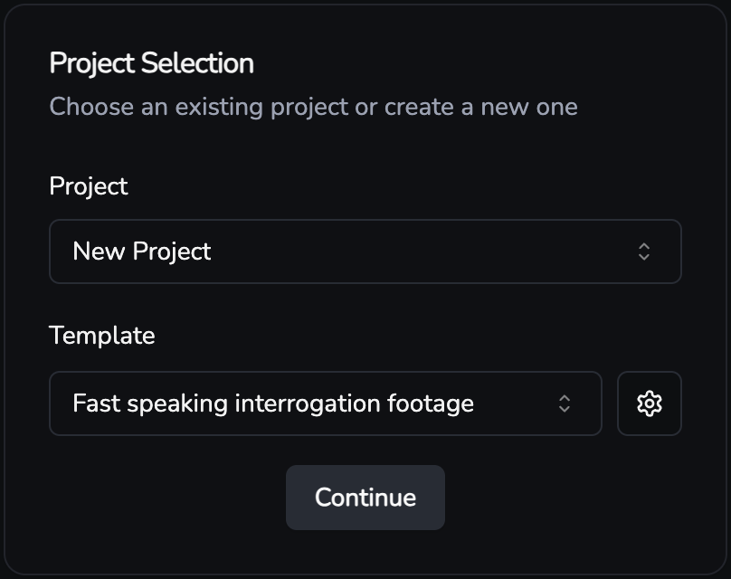

# Content Killer <svg xmlns="http://www.w3.org/2000/svg" width="24" height="24" viewBox="0 0 24 24" fill="none" stroke="currentColor" stroke-width="2" stroke-linecap="round" stroke-linejoin="round" class="lucide lucide-skull"><path d="m12.5 17-.5-1-.5 1h1z"/><path d="M15 22a1 1 0 0 0 1-1v-1a2 2 0 0 0 1.56-3.25 8 8 0 1 0-11.12 0A2 2 0 0 0 8 20v1a1 1 0 0 0 1 1z"/><circle cx="15" cy="12" r="1"/><circle cx="9" cy="12" r="1"/></svg>

<div align="center">
  
[](https://www.typescriptlang.org/)
[](https://reactjs.org/)
[](LICENSE)

An experimental AI-powered YouTube video commentary generator that transforms source videos into analytical content.

[Demo](#demo) · [Setup](#setup) · [Architecture](#architecture)

</div>

## Overview

Content Killer is an experiment in automated video content generation, exploring the possibilities of AI in video editing and commentary creation. It uses prompt chaining to analyse, describe, and generate professional commentary & editing for YouTube videos in several steps.


### Demo

| Source video                                                                                          | AI-generated output (no manual editing)                                                 |
| ----------------------------------------------------------------------------------------------------- | --------------------------------------------------------------------------------------- |
| [](https://www.youtube.com/watch?v=iEmDdWZOmo4) | [](https://youtu.be/-1jVvmsGL4Y) |

## Architecture

### Pipeline

1. **Video Analysis**: Uses Gemini Vision for scene comprehension and description
2. **Commentary Generation**: OpenAI for commentary generation
3. **Voice Synthesis**: ElevenLabs for voice synthesis
4. **Video Processing**: FFmpeg for video manipulation and assembly based on generated commentary and settings

Customisation is possible by changing the settings at each step. Project and template states are stored in the database.

### Tech stack

- **Frontend**: React, TypeScript, TanStack Query, Shadcn UI, Tailwind CSS
- **Backend**: Bun Runtime, Hono, FFmpeg, SQLite
- **AI Services**: Gemini API, OpenAI API, ElevenLabs API

## Setup

### Prerequisites

- [ffmpeg](https://ffmpeg.org/)
- [yt-dlp](https://github.com/yt-dlp/yt-dlp)
- API keys for [Gemini](https://gemini.google.com/), [OpenAI](https://platform.openai.com/), and [ElevenLabs](https://elevenlabs.io/)

```bash
git clone https://github.com/yourusername/content-killer.git
cd content-killer
bun install

# Configure environment
cp server/.env.example server/.env
cp client/.env.example client/.env

# Start development
bun run dev
```

## Features

### Project Management


- Template system for multiple channel styles
- Local project storage for both projects and templates
- Custom pause sounds & generation settings



### Manual editing


- Edit the generated description/commentary in a custom json editor

## License

MIT License - See [LICENSE](LICENSE) for details.
