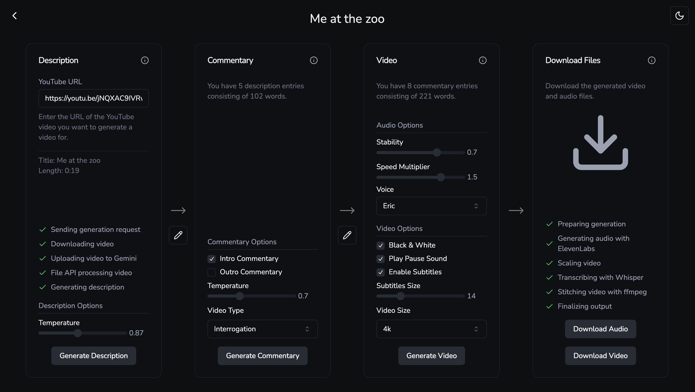

# Content Killer <svg xmlns="http://www.w3.org/2000/svg" width="28" height="28" viewBox="0 0 24 22" fill="none" stroke="currentColor" stroke-width="2" stroke-linecap="round" stroke-linejoin="round" class="lucide lucide-skull"><path d="m12.5 17-.5-1-.5 1h1z"/><path d="M15 22a1 1 0 0 0 1-1v-1a2 2 0 0 0 1.56-3.25 8 8 0 1 0-11.12 0A2 2 0 0 0 8 20v1a1 1 0 0 0 1 1z"/><circle cx="15" cy="12" r="1"/><circle cx="9" cy="12" r="1"/></svg>

<div align="center">
  
</div>

Transform YouTube videos into professional commentary videos in the style of JCS using AI in different genres (police bodycam, sports commentary, poker hand breakdowns, interrogation analysis).

## Example output (no manual editing)

| Input                                                                                                       | Output                                                                                        |
| ----------------------------------------------------------------------------------------------------------- | --------------------------------------------------------------------------------------------- |
| [](https://www.youtube.com/watch?v=iEmDdWZOmo4) | [](https://youtu.be/-1jVvmsGL4Y) |
| Original police bodycam footage                                                                             | AI-generated commentary version                                                               |

## 🛠 Technical Implementation

The pipeline processes videos through several stages:

1. **Description Generation**

   - Downloads source video using yt-dlp
   - Uploads to gemini's file api for processing
   - Generates a description of the video with gemini model of choice
   - Manual editing of description is possible

2. **Commentary Generation**

   - Uses description data as input for OpenAI model of choice
   - Generates commentary based on video type
   - Manual editing of commentary is possible

3. **Video & Audio Generation**
   - Synthesizes voice using ElevenLabs
   - Processes video with FFmpeg:
     - Scales video to target resolution
     - Generates subtitles with Whisper (optional)
     - Adds B&W filter during pauses (optional)
     - Adds pause sounds (optional)
     - Overlays commentary audio
   - Outputs final video with all elements combined

### AI Integration

<div align="center">
  
</div>

- 🧠 **Scene Analysis**: Gemini API for video understanding
- 💬 **Commentary**: GPT-4 with genre-specific prompts
- 🗣 **Voice**: ElevenLabs with stability/speed control
- 📝 **Subtitles**: Whisper for accurate transcription

### Project Management

<div align="center">
  
</div>

- Save and manage multiple projects
- Create custom templates with default settings
- Stored locally in sqlite database

## ⚡️ Quick Start

```bash
# install dependencies
bun install

# environment variables
cp server/.env.example server/.env

cp client/.env.example client/.env

# start development servers
bun run dev
```

### Prerequisites

- `bun` - Runtime & package manager
- `ffmpeg` - Video processing
- `yt-dlp` - Video downloading

## Tech Stack

- **Frontend**: React, TypeScript, TanStack Query, Shadcn UI
- **Backend**: Bun, Hono, FFmpeg
- **Storage**: SQLite for project & template management

## Learning Outcomes

1. **Complex FFmpeg Processing**: Learned about video processing, filter graphs, and frame-accurate editing
2. **AI Integration**: Implemented rate limiting, error handling, and prompt engineering
3. **State Management**: Explored SQLite's capabilities and limitations as a project database
4. **Type Safety**: Built with end-to-end type safety using Zod and TypeScript
